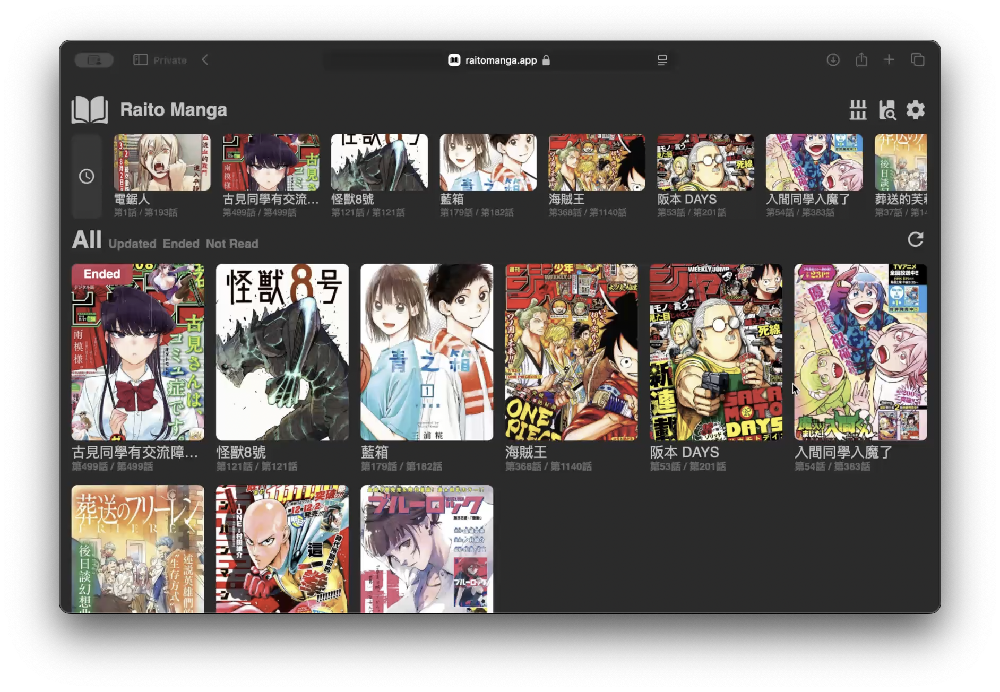

<div align="center">

# Raito Manga

[](https://github.com/nohackjustnoobb/Raito-Manga/actions/workflows/Nightly%20Build.yml)
[](https://github.com/nohackjustnoobb/Raito-Manga/blob/master/LICENSE)
[](https://hub.docker.com/repository/docker/nohackjustnoobb/raito-manga)

</div>



Raito Manga is an open-source, cross-platform application that offers a lightweight and efficient solution for managing and reading manga. It features seamless syncing, multi-language support, and an extensible framework, enabling users to easily organize, explore, and enjoy their manga with optimized performance and intuitive navigation. Discover more through our [live demonstration](https://raitomanga.app).

This application contains 3 components, including [Raito-Web-Client](https://github.com/nohackjustnoobb/Raito-Web-Client), [Raito-Server](https://github.com/nohackjustnoobb/Raito-Server), and [Raito-Sync](https://github.com/nohackjustnoobb/Raito-Sync). There is also one optional component, [Raito-Admin-Panel](https://github.com/nohackjustnoobb/Raito-Admin-Panel).

### Raito Web Client

[](https://github.com/nohackjustnoobb/Raito-Web-Client/actions/workflows/main.yml)

Raito Web Client is the front-end component of the application, developed using Typescript and React. It can be built into static files. For more details, refer to its [repository](https://github.com/nohackjustnoobb/Raito-Web-Client).

### Raito Server

[](https://github.com/nohackjustnoobb/Raito-Server/actions/workflows/main.yml)

Raito Server is responsible for fetching manga from various sources, developed using C++ and Drogon. The web client can interact with multiple servers simultaneously, allowing you to set up your own server while using our sync server and webpage. For more details, refer to its [repository](https://github.com/nohackjustnoobb/Raito-Server).

### Raito Sync

[](https://github.com/nohackjustnoobb/Raito-Sync/actions/workflows/main.yml)

Raito Sync is a server designed to synchronize data across devices, developed using Golang and Fiber. For more details, refer to its [repository](https://github.com/nohackjustnoobb/Raito-Sync).

### Raito Admin Panel

[](https://github.com/nohackjustnoobb/Raito-Admin-Panel/actions/workflows/main.yml)

Raito Admin Panel is the front-end for the admin interface, developed using Typescript and Svelte. If the CMS feature is enabled on the server, this panel is required to access the interface. For more details, refer to its [repository](https://github.com/nohackjustnoobb/Raito-Admin-Panel).

## Quick Start

_There is an all-in-one Docker image that bundles both the front-end and back-end components. This image internally launches the two backend servers and uses Nginx to reverse proxy incoming requests to the appropriate server. For optimal performance, consider setting up the servers separately._

1. Create the configuration based on the `config_template.json`. The minimal configuration is a single file named 'config.json', which can be created with `touch config.json`.

2. Create a `docker-compose.yml` file like this:

```yml
version: "3"

services:
  raito-manga:
    image: nohackjustnoobb/raito-manga
    container_name: raito-manga
    restart: unless-stopped
    ports:
      - 8080:80
    volumes:
      - ./data:/data
      - ./config.json:/config.json
```

3. Create the container

```bash
sudo docker-compose up -d
```

## Disclaimer

This software is developed solely for educational and demonstration purposes. It is intended to be used as a learning tool and to showcase the capabilities of the application. Any use of this software for purposes other than education and demonstration is not endorsed or supported by the developers.
